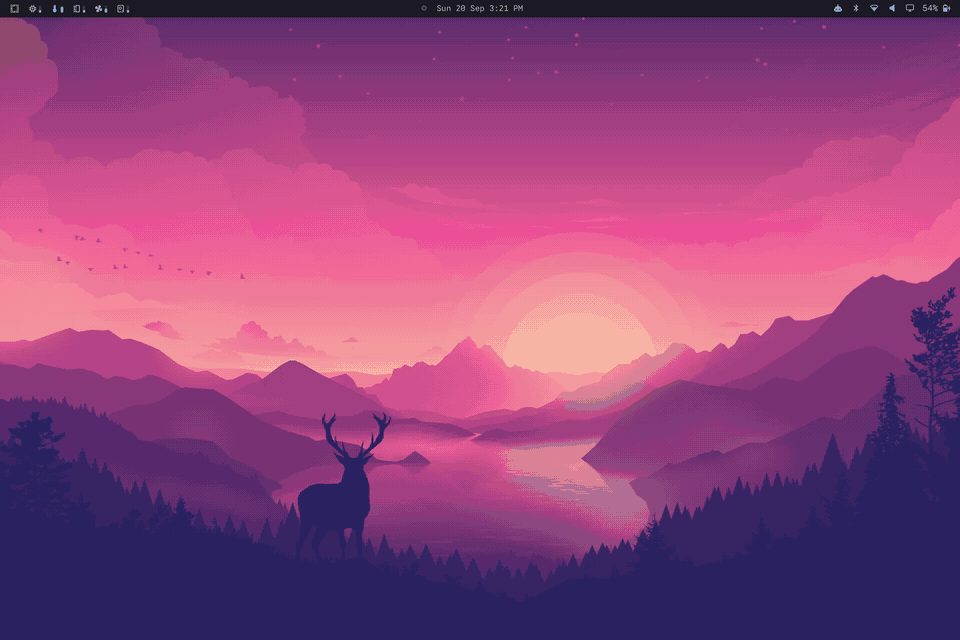

# Corners

Rounded corners for your Omarchy desktop. Corners fills the four screen corners
and the two small gaps where the bar meets your wallpaper. The fills follow
your window rounding and bar position, so they fit in without much setup.



## Install

This plugin needs Omarchy's Quickshell shell. Install and enable it with:

```bash
omarchy plugin add https://github.com/turbineBMW/Corners --enable
```

The screen corners are black by default. The bar corners use your theme's bar
color and disappear when the bar is hidden or transparent.

## Make it yours

The default curve follows Hyprland's window rounding. To adjust it, add
settings to the Corners entry in `~/.config/omarchy/shell.json`:

```json
{
  "id": "turbinebmw.corners",
  "screenRadius": 20,
  "barRadius": 20,
  "screenColor": "#000000"
}
```

Leave a radius or color out to keep its default. Set `screen` or `bar` to
`false` if you only want one set of corners. `barColor` can override the
theme's bar color. Changes to `shell.json` reload automatically.

## Remove

```bash
omarchy plugin remove turbinebmw.corners
```

Corners installs no packages and writes no extra files. It is released under
the [MIT license](LICENSE).
